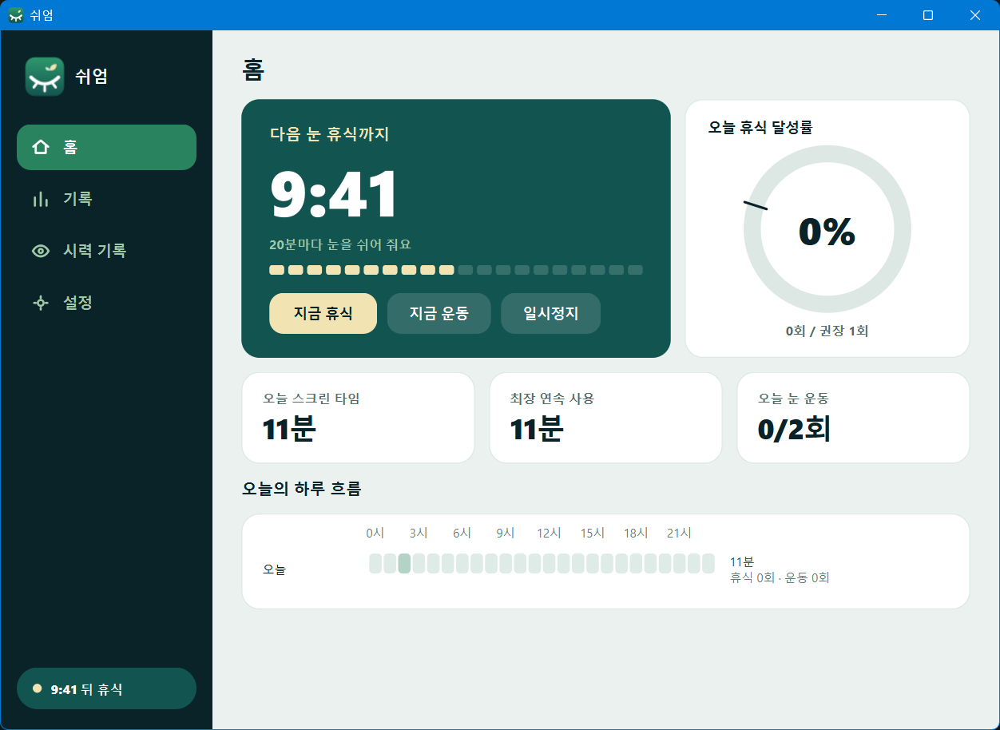
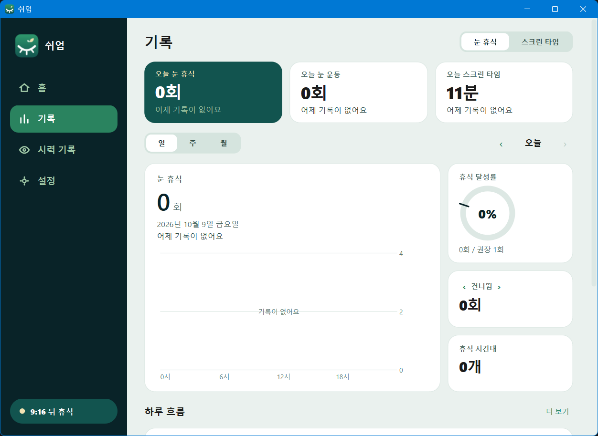
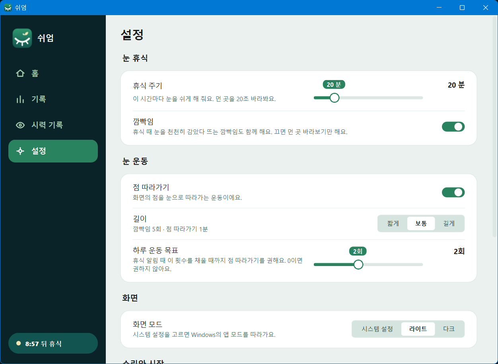
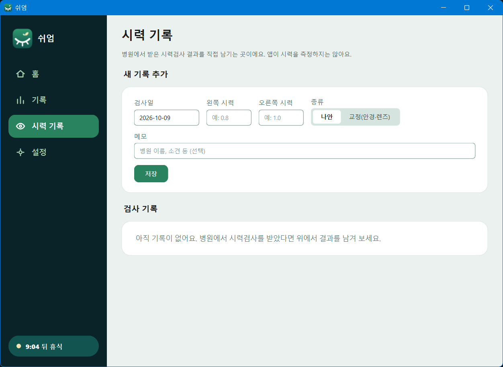
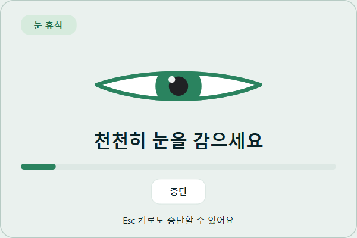
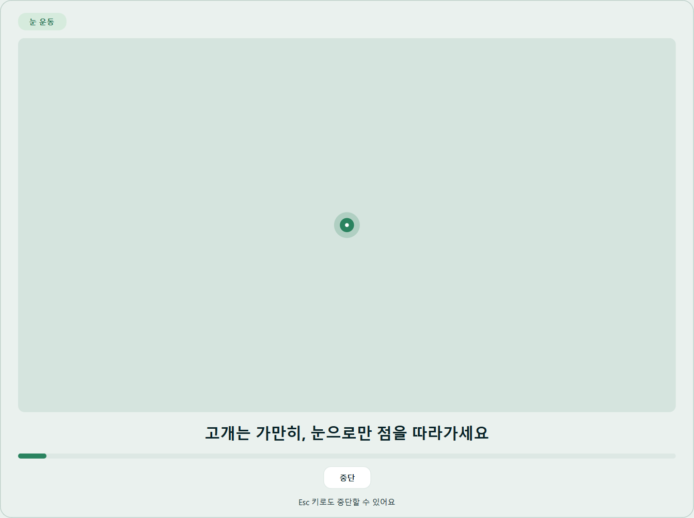

# 쉬엄

PC를 쓰는 동안 일정 간격으로 눈 운동을 알려 주는 Windows 트레이 상주 앱입니다.
(코드 이름: EyeExercise)

> 개발 중인 테스트 버전입니다. Windows 11(64비트)에서 확인했고, 다른 Windows 버전에서는 아직 확인하지 못했습니다.

## 화면


| 기록 | 설정 | 시력 기록 |
|---|---|---|
|  |  |  |

| 알림 팝업 | 눈 깜빡임 | 점 따라가기 |
|---|---|---|
|  |  |  |

## 기능
- **주기 알림:** 기본 20분마다 눈 휴식을 알려 줍니다. 간격은 설정에서 바꿀 수 있습니다.
- **눈 휴식:** 눈 깜빡임 운동과 먼 곳 바라보기를 안내합니다. 눈을 감고도 들을 수 있게 음성이나 알림음으로 알려 줍니다.
- **눈 운동:** 화면의 점을 눈으로 따라가는 운동 가이드입니다.
- **미루기 / 건너뛰기:** 지금 쉬기 어려우면 알림을 미루거나 건너뜁니다.
- **기록:** 일별 휴식·운동 기록과 달성률, 스크린 타임(시간대별 PC 사용 시간), 시력 기록을 보여 줍니다.
- **트레이 상주:** 메인 창을 닫아도 종료하지 않고 트레이로 숨습니다. 종료는 트레이 메뉴의 "종료"로 합니다.
- 라이트·다크 모드를 지원합니다.

## 개인정보
쉬엄은 필요한 최소한의 정보만 이 PC에 저장합니다.

- **카메라를 사용하지 않습니다.**
- **네트워크 통신을 하지 않습니다.** 데이터를 외부로 전송하는 코드가 없습니다.
- **키 입력 내용을 수집하지 않습니다.** 자리 비움과 스크린 타임은 Windows의 "마지막 입력 시각"(`GetLastInputInfo`)만 보고 입력이 있었는지 여부만 판단합니다. 어떤 키를 눌렀는지는 알 수 없습니다.
- **어떤 프로그램을 쓰는지, 창 제목은 수집하지 않습니다.**
- 이 원칙은 자동 테스트(`tests/test_forbidden_imports.py`)로 고정되어 있어서, 네트워크·카메라·키 입력 관련 코드가 들어오면 테스트가 실패합니다.

### 저장되는 것
데이터는 이 PC의 `%APPDATA%\Swieom` 폴더에만 JSON 파일로 저장됩니다. 지우면 기록이 사라집니다.
(Windows 로밍 프로필이나 클라우드 백업을 켜 둔 환경에서는 Windows가 이 폴더를 동기화할 수 있습니다. 쉬엄이 보내는 것은 아닙니다.)

| 파일 | 내용 |
|---|---|
| `settings.json` | 설정 |
| `history.json` | 휴식·운동·미루기·건너뛰기 기록 |
| `usage.json` | 시간대별 PC 사용 시간 |
| `vision.json` | 직접 입력한 시력 기록 |

파일이 손상되면 `.corrupt` 이름으로 백업하고 새로 시작합니다.

## 설치 (exe)
1. 받은 zip(`Swieom-<버전>-win64.zip`)의 압축을 풉니다. 폴더 안의 `_internal` 폴더는 지우지 마세요.
2. `Swieom.exe`를 실행하면 트레이에 아이콘이 생기고 메인 창이 뜹니다. 설치 과정은 없습니다.
3. PC를 켤 때 자동으로 시작하려면 설정 → "소리와 시작"에서 **"Windows를 켤 때 같이 실행"** 을 켜세요. 기본은 꺼져 있고, 켤 때만 현재 사용자의 시작 항목에 등록됩니다.

### 지우기
1. 설정에서 **"Windows를 켤 때 같이 실행"을 먼저 끕니다.** (켠 채로 폴더만 지우면 PC를 켤 때마다 실행 실패 메시지가 뜹니다.)
2. 트레이 메뉴의 "종료"로 끄고, 프로그램 폴더를 지웁니다.
3. 기록까지 지우려면 `%APPDATA%\Swieom` 폴더도 지웁니다.

쉬엄은 서비스, 예약 작업, 방화벽 규칙을 만들지 않고 관리자 권한도 필요 없습니다. 자동 실행을 켰을 때의 시작 항목(`HKCU\...\Run`의 `Swieom`) 외에는 레지스트리를 쓰지 않습니다.

### "Windows의 PC 보호" 경고가 뜰 때
쉬엄은 아직 코드 서명(유료 인증서)이 없어서, 내려받은 파일을 처음 실행하면 Windows SmartScreen이 경고를 띄울 수 있습니다.
**"추가 정보" → "실행"** 을 누르면 실행됩니다. 이 경고는 프로그램이 위험하다는 뜻이 아니라 서명되지 않은 새 프로그램이라는 뜻입니다.
소스 코드가 공개되어 있고 네트워크 통신을 하지 않으므로, 의심되면 직접 확인할 수 있습니다.

### 백신(Windows 보안)이 막을 때
서명이 없는 exe는 일부 백신이 잘못 의심(오탐)하기도 합니다. Windows 보안이 파일을 격리했다면
**Windows 보안 → 바이러스 및 위협 방지 → 보호 기록**에서 항목을 찾아 "허용"을 누르세요.
압축을 푼 폴더 전체(`_internal` 포함)가 그대로 있어야 실행됩니다.

## 소스에서 실행하기
Windows와 Python 3.12가 필요합니다.

```
py -3.12 -m venv .venv
.venv\Scripts\python -m pip install -r requirements-dev.txt
.venv\Scripts\python -m pip install -e .
.venv\Scripts\python -m eyeexercise
```

테스트:

```
.venv\Scripts\python -m pytest
```

exe 빌드와 배포용 zip 만들기:

```
.venv\Scripts\python -m PyInstaller eyeexercise.spec --noconfirm
.venv\Scripts\python tools\package_release.py
```

## 구조
- `src/eyeexercise/core/`: 스케줄러, 미루기/건너뛰기, 기록 집계 같은 판단 로직. Qt 없는 순수 Python이라 pytest로 바로 테스트합니다.
- `src/eyeexercise/ui/`: PySide6 화면. 얇게 유지하고 `core/`를 호출만 합니다.
- `src/eyeexercise/platform/`: Windows 전용 호출(유휴 시간, 창 설정).
- `src/eyeexercise/storage/`: JSON 저장과 손상 복구.
- 시간과 유휴 시간은 주입할 수 있게 만들어서 테스트에서 가짜로 바꿉니다.

## 사용한 오픈소스
- [PySide6 (Qt for Python)](https://doc.qt.io/qtforpython-6/): GUI. LGPL v3 등으로 제공됩니다.
- [pytest](https://pytest.org/): 테스트.
- [PyInstaller](https://pyinstaller.org/): exe 빌드(예정).

## 라이선스
[MIT 라이선스](LICENSE)입니다. 작동에 대한 보증이 없고, 사용으로 생긴 문제에 책임지지 않습니다.

쉬엄이 사용하는 PySide6(Qt)는 별도의 라이선스(LGPL v3 등)를 따릅니다. 이 라이선스는 위 MIT와 별개이며, exe로 배포할 때는 해당 라이선스 고지를 함께 제공합니다.
